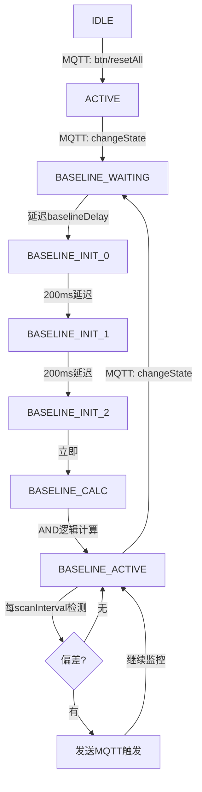

# 基线逻辑深度分析

## 概述

本文档详细分析了激光传感器系统的基线捕获和偏差检测逻辑，包括三轮扫描机制、AND逻辑融合算法、以及实时监控流程。

---

## 一、基线建立流程

### 1.1 状态机设计

系统采用7状态状态机设计：

```
IDLE → ACTIVE → BASELINE_WAITING → BASELINE_INIT_0 → BASELINE_INIT_1
     → BASELINE_INIT_2 → BASELINE_CALC → BASELINE_ACTIVE
```

| 状态 | 说明 | 触发条件 | 持续时间 |
|------|------|----------|----------|
| `IDLE` | 初始状态，等待系统激活 | MQTT `btn/resetAll` | 无限 |
| `ACTIVE` | 系统已激活，等待基线设置命令 | MQTT `changeState` | 无限 |
| `BASELINE_WAITING` | 延迟等待，用户可配置 | 延迟时间到达 | `baselineDelay` (默认200ms) |
| `BASELINE_INIT_0` | 第一次基线扫描 | 200ms延迟后 | 扫描时长 (~100ms) |
| `BASELINE_INIT_1` | 第二次基线扫描 | 200ms延迟后 | 扫描时长 (~100ms) |
| `BASELINE_INIT_2` | 第三次基线扫描 | 200ms延迟后 | 扫描时长 (~100ms) |
| `BASELINE_CALC` | 计算最终基线 (AND逻辑) | 立即 | 计算时长 (~1ms) |
| `BASELINE_ACTIVE` | 基线监控模式 | `baselineStableTime` 后开始 | 无限 (直到下一个`changeState`) |

### 1.2 三轮扫描机制

**目的**: 消除传感器噪声和瞬态干扰，提高基线稳定性。

**实现**:
- 每次扫描读取4个Modbus设备，每设备48个输入 (共192位)
- 扫描间隔: 200ms (可通过串口命令 `si=` 调整)
- 数据存储在独立数组: `init_0[][]`, `init_1[][]`, `init_2[][]`

**代码位置**: [src/main.cpp:303-321](src/main.cpp#L303-L321)

```cpp
void scanBaseline(uint8_t targetArray[NUM_DEVICES][NUM_INPUTS_PER_DEVICE]) {
    for (int device = 1; device <= NUM_DEVICES; device++) {
        readInputStatus(device, targetArray[device - 1]);
        delay(20); // 设备间延迟，避免RS485总线冲突
    }
}
```

---

## 二、AND逻辑融合算法

### 2.1 核心逻辑

**规则**: 只有在三次扫描中**全部为1**的位，才会被设置为基线并启用监控掩码。

**代码位置**: [src/main.cpp:326-389](src/main.cpp#L326-L389)

```cpp
void calculateFinalBaseline() {
    for (int device = 1; device <= NUM_DEVICES; device++) {
        for (int i = 0; i < NUM_INPUTS_PER_DEVICE; i++) {
            int trueCount = init_0[device-1][i] + init_1[device-1][i] + init_2[device-1][i];

            if (trueCount == 3) {
                baseline[device-1][i] = 1;
                baselineMask[device-1][i] = 1;  // 启用监控
            } else {
                baseline[device-1][i] = 0;
                baselineMask[device-1][i] = 0;  // 禁用监控
            }
        }
    }
}
```

### 2.2 基线掩码 (Baseline Mask)

**作用**:
- `baselineMask[device][input] = 1`: 该位稳定，参与后续偏差检测
- `baselineMask[device][input] = 0`: 该位不稳定或抖动，被排除在监控之外

**优势**:
- 自动过滤掉不稳定的传感器通道
- 避免误触发 (如传感器边缘信号不稳定、环境干扰等)
- 提高系统可靠性

### 2.3 数据输出示例

执行基线计算时，串口会打印详细的数据分析：

```
╔════════════════════════════════════════════╗
║  CALCULATING FINAL BASELINE FROM 3 SCANS  ║
╚════════════════════════════════════════════╝

========== SCAN #0 (init_0) ==========
Device 1: 111111111111 | 000000000000 | 000000000000 | 000000000000
Device 2: 111111111111 | 000000000000 | 000000000000 | 000000000000
Device 3: 000000000000 | 000000000000 | 000000000000 | 000000000000
Device 4: 000000000000 | 000000000000 | 000000000000 | 000000000000
======================================
Active bits in scan #0: 24 / 192

========== SCAN #1 (init_1) ==========
Device 1: 111111111111 | 000000000000 | 000000000000 | 000000000000
Device 2: 111011111111 | 000000000000 | 000000000000 | 000000000000
Device 3: 000000000000 | 000000000000 | 000000000000 | 000000000000
Device 4: 000000000000 | 000000000000 | 000000000000 | 000000000000
======================================
Active bits in scan #1: 23 / 192

========== SCAN #2 (init_2) ==========
Device 1: 111111111111 | 000000000000 | 000000000000 | 000000000000
Device 2: 111111111111 | 000000000000 | 000000000000 | 000000000000
Device 3: 000000000000 | 000000000000 | 000000000000 | 000000000000
Device 4: 000000000000 | 000000000000 | 000000000000 | 000000000000
======================================
Active bits in scan #2: 24 / 192

>>> Applying AND logic (only bits that are 1 in ALL scans)...

========== FINAL BASELINE (AND result) ==========
Device 1: 111111111111 | 000000000000 | 000000000000 | 000000000000
Device 2: 111011111111 | 000000000000 | 000000000000 | 000000000000
Device 3: 000000000000 | 000000000000 | 000000000000 | 000000000000
Device 4: 000000000000 | 000000000000 | 000000000000 | 000000000000
======================================
✓ Final baseline: 23 bits set to 1 (will be monitored)

========== BASELINE MASK (monitored bits) ==========
Device 1: 111111111111 | 000000000000 | 000000000000 | 000000000000
Device 2: 111011111111 | 000000000000 | 000000000000 | 000000000000
Device 3: 000000000000 | 000000000000 | 000000000000 | 000000000000
Device 4: 000000000000 | 000000000000 | 000000000000 | 000000000000
======================================
✓ Monitoring mask: 23 / 192 bits enabled

>>> Consistency Analysis:
  - Bits lost from scan #0: 1
  - Bits lost from scan #1: 0
  - Bits lost from scan #2: 1
  - Consistency rate: 95.8%

╔════════════════════════════════════════════╗
║  BASELINE READY - Waiting 500 ms for stable  ║
╚════════════════════════════════════════════╝
```

**分析说明**:
- Device 2 的 Input 3 在 Scan #1 中为 0，因此被排除在基线之外
- 一致性率为 95.8% (23/24)，表示大部分传感器信号稳定
- 最终只有23个位被监控，避免了1个不稳定位的干扰

---

## 三、实时偏差检测

### 3.1 检测逻辑

**代码位置**: [src/main.cpp:412-508](src/main.cpp#L412-L508)

```cpp
bool checkForChanges() {
    // 扫描所有设备
    uint8_t currentScan[NUM_DEVICES][NUM_INPUTS_PER_DEVICE];

    // 只对掩码为1的位进行比较
    for (int device = 1; device <= NUM_DEVICES; device++) {
        for (int i = 0; i < NUM_INPUTS_PER_DEVICE; i++) {
            if (baselineMask[device-1][i] == 1) {  // 关键：只比较掩码启用的位
                if (currentScan[device-1][i] != baseline[device-1][i]) {
                    return true; // 检测到偏差
                }
            }
        }
    }
    return false;
}
```

### 3.2 扫描输出示例

**正常扫描** (无偏差):
```
[Scan #1] Checking baseline deviations...
  Device 1: 12 active bits
  Device 2: 11 active bits
  Device 3: 0 active bits
  Device 4: 0 active bits

  >>> Comparing with baseline (masked bits only):
  ✓ No deviations detected - baseline stable
```

**检测到偏差**:
```
[Scan #5] Checking baseline deviations...
  Device 1: 11 active bits
  Device 2: 11 active bits
  Device 3: 0 active bits
  Device 4: 0 active bits

  >>> Comparing with baseline (masked bits only):

  !!! DEVIATION DETECTED !!!
    Device 1, Input 5 [Grid: Row 6, Col 5]: Baseline=1 -> Current=0

  Device 1: 1 deviations found

  ✗ Total deviations: 1
  ╔════════════════════════════════════════════╗
  ║        TRIGGERING BASELINE ALERT!          ║
  ╚════════════════════════════════════════════╝

========== TRIGGERED SCAN DATA ==========
Device 1: 111111011111 | 000000000000 | 000000000000 | 000000000000
Device 2: 111011111111 | 000000000000 | 000000000000 | 000000000000
Device 3: 000000000000 | 000000000000 | 000000000000 | 000000000000
Device 4: 000000000000 | 000000000000 | 000000000000 | 000000000000
======================================
```

### 3.3 硬件坐标映射

系统使用 `INDEX_MAP[]` 数组将线性Modbus索引转换为物理网格坐标 (12x12)。

**示例**:
- Device 1, Input 5 → 线性索引 5 → 物理坐标 `(row=6, col=5)`

这使得调试时可以快速定位物理传感器位置。

---

## 四、串口调试命令

新增了三个强大的调试命令：

### 4.1 `status` 或 `s` - 系统状态
```
========== System Configuration ==========
Baseline Delay (bd):      200 ms
Scan Interval (si):       200 ms
Baseline Stable Time (st): 500 ms
Current State:            7 (BASELINE_ACTIVE)
MQTT Connected:           Yes
Trigger Sent:             No
==========================================
```

### 4.2 `baseline` 或 `b` - 基线数据
```
========== Baseline Information ==========
[打印完整的baseline和baselineMask数据]
Active baseline bits: 23 / 192
Monitored bits: 23 / 192
==========================================
```

### 4.3 `scan` 或 `sc` - 手动扫描
```
========== Manual Scan ==========
✓ Device 1 scanned successfully
✓ Device 2 scanned successfully
✓ Device 3 scanned successfully
✓ Device 4 scanned successfully

[打印完整扫描数据]
Active bits: 23 / 192
=================================
```

---

## 五、关键参数调优

### 5.1 可配置参数

| 参数 | 默认值 | 范围 | 串口命令 | 说明 |
|------|--------|------|----------|------|
| **基线延迟** | 200ms | 0-5000ms | `bd=<value>` | 收到`changeState`后等待多久开始扫描 |
| **扫描间隔** | 200ms | 100-2000ms | `si=<value>` | 三次基线扫描之间的间隔 / 监控扫描周期 |
| **稳定时间** | 500ms | 0-5000ms | `st=<value>` | 基线建立后等待多久开始监控 |

### 5.2 调优建议

**场景1: 快速响应，传感器稳定**
```
bd=0       // 立即开始扫描
si=100     // 100ms扫描间隔 (最快)
st=100     // 100ms稳定时间
```

**场景2: 传感器信号抖动严重**
```
bd=500     // 等待500ms让传感器稳定
si=500     // 500ms扫描间隔
st=1000    // 1秒稳定时间
```

**场景3: 调试/分析模式**
```
bd=200     // 默认延迟
si=300     // 稍慢的扫描间隔
st=500     // 默认稳定时间
```

配合 `scan` 命令进行手动扫描验证。

---

## 六、数据打印功能

### 6.1 自动打印时机

1. **三次基线扫描时**: 每次扫描后立即打印原始数据
2. **基线计算时**: 打印三次扫描数据 + 最终基线 + 掩码 + 一致性分析
3. **每10次监控扫描**: 打印当前扫描数据 (减少串口输出量)
4. **检测到偏差时**: 打印触发时的完整扫描数据

### 6.2 格式化输出

**网格布局**:
```
Device 1: 111111111111 | 000000000000 | 000000000000 | 000000000000
          ^--- 每12位添加分隔符 ---|
```
- 每设备48位分为4组，每组12位
- 方便对应物理12x12网格布局

**统计信息**:
```
Active bits in scan #0: 24 / 192
                        ^^   ^^^ 总位数
                        |____ 活跃位数
```

---

## 七、系统工作流程总结



**关键点**:
1. 系统不会自动停止监控，会持续在 `BASELINE_ACTIVE` 状态
2. 收到新的 `changeState` 消息时，重新建立基线
3. 检测到偏差后发送一次MQTT消息 (`triggerSent = true`)，不会重复发送
4. 下次 `changeState` 会重置 `triggerSent` 标志

---

## 八、故障排查指南

### 8.1 基线一致性低

**症状**: `Consistency rate < 90%`

**排查步骤**:
1. 使用 `scan` 命令多次手动扫描，观察数据稳定性
2. 如果某些位持续抖动，检查对应传感器硬件
3. 增加 `baselineDelay` 和 `scanInterval`，例如:
   ```
   bd=500
   si=500
   st=1000
   ```

### 8.2 误触发

**症状**: 频繁检测到偏差，但实际无物体经过

**排查步骤**:
1. 使用 `baseline` 命令查看哪些位被监控
2. 对比实际物理环境，是否有传感器边缘信号不稳定
3. 考虑调整传感器位置或遮挡

### 8.3 漏检测

**症状**: 物体经过但未触发

**排查步骤**:
1. 使用 `baseline` 命令查看掩码，确认目标位置被监控
2. 使用 `scan` 命令验证传感器是否响应物体
3. 检查物体是否在传感器检测范围内

---

## 九、性能分析

### 9.1 时间开销

| 操作 | 时间 | 说明 |
|------|------|------|
| 单设备读取 | ~50ms | Modbus RTU @ 9600baud |
| 完整扫描 (4设备) | ~260ms | 4×50ms + 3×20ms延迟 |
| 基线计算 | ~1ms | 纯计算，无I/O |
| 三次基线扫描总时 | ~1180ms | 260ms×3 + 400ms延迟 |

### 9.2 内存占用

| 数组 | 大小 | 说明 |
|------|------|------|
| `init_0[][]` | 192 bytes | 第一次扫描 |
| `init_1[][]` | 192 bytes | 第二次扫描 |
| `init_2[][]` | 192 bytes | 第三次扫描 |
| `baseline[][]` | 192 bytes | 最终基线 |
| `baselineMask[][]` | 192 bytes | 监控掩码 |
| **总计** | **960 bytes** | ESP32-S3内存充足 |

---

## 十、代码改进建议

### 10.1 已实现的优化

✅ 三轮扫描 + AND逻辑消除噪声
✅ 基线掩码机制，只监控稳定位
✅ 详细的串口调试输出
✅ 硬件坐标映射 (便于定位)
✅ 可配置的时间参数
✅ 手动扫描命令 (调试利器)

### 10.2 可选的未来增强

1. **基线存储**: 将基线保存到NVS闪存，断电重启后恢复
2. **自适应阈值**: 根据传感器噪声水平动态调整掩码
3. **时间戳记录**: 记录每次偏差的精确时间
4. **统计功能**: 累计触发次数、平均一致性率等
5. **Web界面可视化**: 在WebUI上显示12x12网格热力图

---

## 附录: 完整状态机代码

参见 [src/main.cpp:550-747](src/main.cpp#L550-L747)
